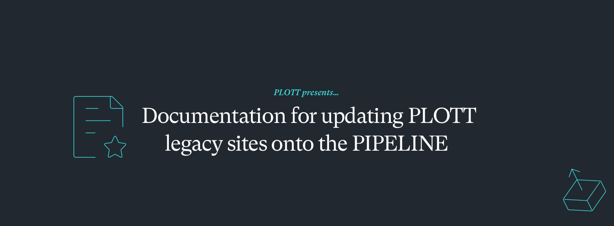

   - `git clone` to pull down the git repo
   - download theme files via FTP from live server
      - push up any descrepancies
- Export database from live server
---
### Using DDEV
1. Config DDEV:
   ```bash
   DDEV config --project-name=SITE_NAME --project-type=wordpress
   ```
   **BEDROCK** 
   ```bash
   DDEV config --project-name=SITE_NAME --project-type=wordpress --docroot=web
   ```

2. Install DDEV Adminer:
   - `ddev add-on get ddev/ddev-adminer`
3. Import the exported database:
   - use `ddev adminer` or `ddev import-db --src=backup.sql`
---
### COMPOSER

1. `composer init` ( or use this [example](https://github.com/ewan-plott/plott-pipe-md/blob/main/example.composer.json) )

**Using BEDROCK?**

   change the wordpress-install-dir to:
   ```json
   "extra": {
      "wordpress-install-dir": "wp" 
   },
   ```

 **Using MU?**

   add this alongside the `wordpress-install-dir`:
```json
"installer-paths": {
      "PATH_TO_MU_PLUGINS/{$name}/": [
            "type:wordpress-muplugin",
      ],
      "PATH_TO_PLUGINS/{$name}/": [
            "type:wordpress-plugin"
      ],
      "PATH_TO_THEMES/{$name}/": [
            "type:wordpress-theme"
      ]
   },
```
## Install all Plugins:
Review active plugins versions
   - Example: `"plugin-name/plugin": "1.2.3"`
   
---

## Changelog tracking with `log_changelog.php`:
   - Copy the [log_changelog.php](https://github.com/ewan-plott/plott-pipe-md/blob/main/log_changelog.php) script to your project root
   - This script logs all dependency changes during composer updates
   - Add the following to the `"scripts"` section in your composer.json
   ```
      "post-update-cmd": [
         "php log_changelog.php"
       ],
   ```
   - update `$SITE_ID` & `$SITE_NAME` on lines `22` & `23`

**REQUIRED FOR ABOVE**

Preserve the `composer.lock`
   - Copy the [save_composer_lock.php](https://github.com/ewan-plott/plott-pipe-md/blob/main/save_composer_lock.php) script to your project root
   - This creates a backup of your current lock file before updates
   - Add the following to the `"scripts"` section in your composer.json:
   ```
   "pre-update-cmd": [
      "php save_composer_lock.php"
   ]
   ```
   - Run `composer update` to update all dependencies while preserving version history

### PLOTT REPMAN

1. Obtain authentication token from the team and configure Composer:
   - `composer config --global --auth http-basic.plottcreative.repo.repman.io token {{REPMAN_TOKEN}}`
   - Replace `{{REPMAN_TOKEN}}` with the actual token provided

2. Configure the Repman repository in Composer:
   - `composer config repositories.plott '{"type": "composer", "url": "https://plottcreative.repo.repman.io"}'`
   - This allows Composer to fetch private Plott plugins

3. Install Plott plugins from the registry:
   - Browse available plugins at [Repman Organization](https://app.repman.io/organization/plottcreative/package)
   - Example: `composer require ashleyarmstrong/plott-gf`

---

### GITHUB WORKFLOWS

1. Set up GitHub Actions workflows:
   - Create `.github/workflows/` directory (see [example templates](https://github.com/ewan-plott/plott-pipe-md/tree/main/github))
   - Copy relevant workflow files to this directory
   - Update **site paths** and **theme paths** to match your project structure
   - Verify the target deployment branch (main or master)

2. Configure secure configuration files:
   - Create a secure [wp-config.php](https://github.com/ewan-plott/plott-pipe-md/blob/main/wp-config.php) with environment variables
   - Create `.env` file with environment-specific settings (do not commit to repository)
   - For legacy sites, remove vulnerable wp-config versions: [remove-wp-config-across-branches](https://github.com/ewan-plott/remove-wp-config-across-branches)

3. Add GitHub repository secrets:
   - Set deployment credentials, API keys, and WordPress salts in GitHub Settings > Secrets
   - These will be injected into workflows at runtime

4. Update `.gitignore` to prevent committing sensitive files:
   - Add `.env`, `wp-config.php`, and `composer.lock` (if using dynamic versioning)

## Cheatsheet

| Prompt      | Desc.       |
| ----------- | ----------- |
| **DDEV** |
| `DDEV config --project-name={$sitename} --project-type=wordpress`     | DDEV Setup |
| `DDEV config --project-name={$sitename} --project-type=wordpress --docroot=web`   | DDEV Setup ( Bedrock ) |
| **Gravity Forms**
| `composer config http-basic.composer.gravity.io LICENSE_KEY https://SITE_URL` | Gravity Forms AUTH |
| `composer config repositories.gravity '{"type": "composer", "url": "https://composer.gravity.io"}'` | Gravity Forms Repo |
| `composer require gravity/gravityforms` | Gravity Forms Plugin |
| **ACF Pro** |
| `composer config repositories.acf '{"type": "composer", "url": "https://connect.advancedcustomfields.com"}'` | ACF Pro Repo |
| `composer require wpengine/advanced-custom-fields-pro` | ACF Pro Plugin |
| **PLOTT REPMAN** |
| `composer config repositories.plott '{"type": "composer", "url": "https://plottcreative.repo.repman.io"}'` | Repo |
